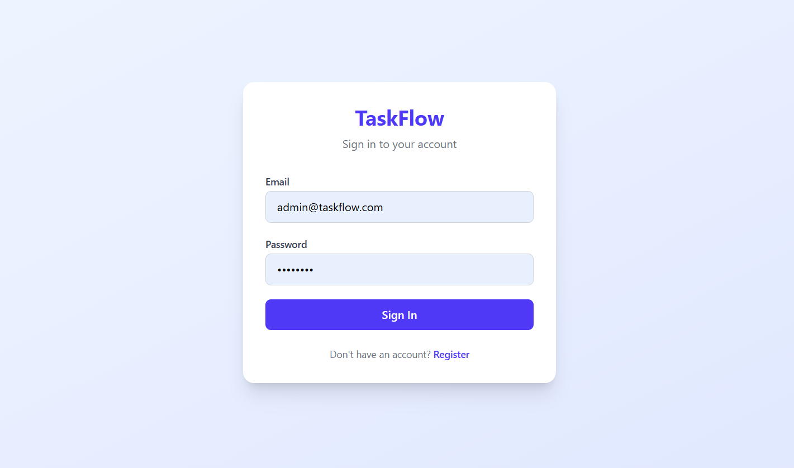
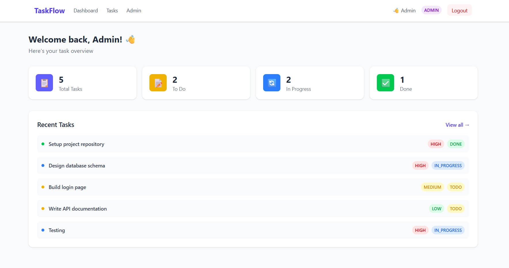
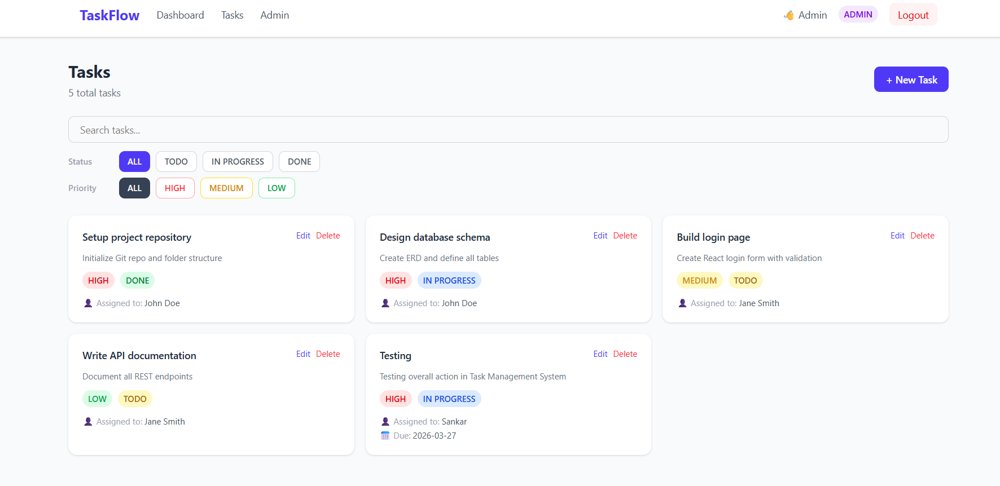
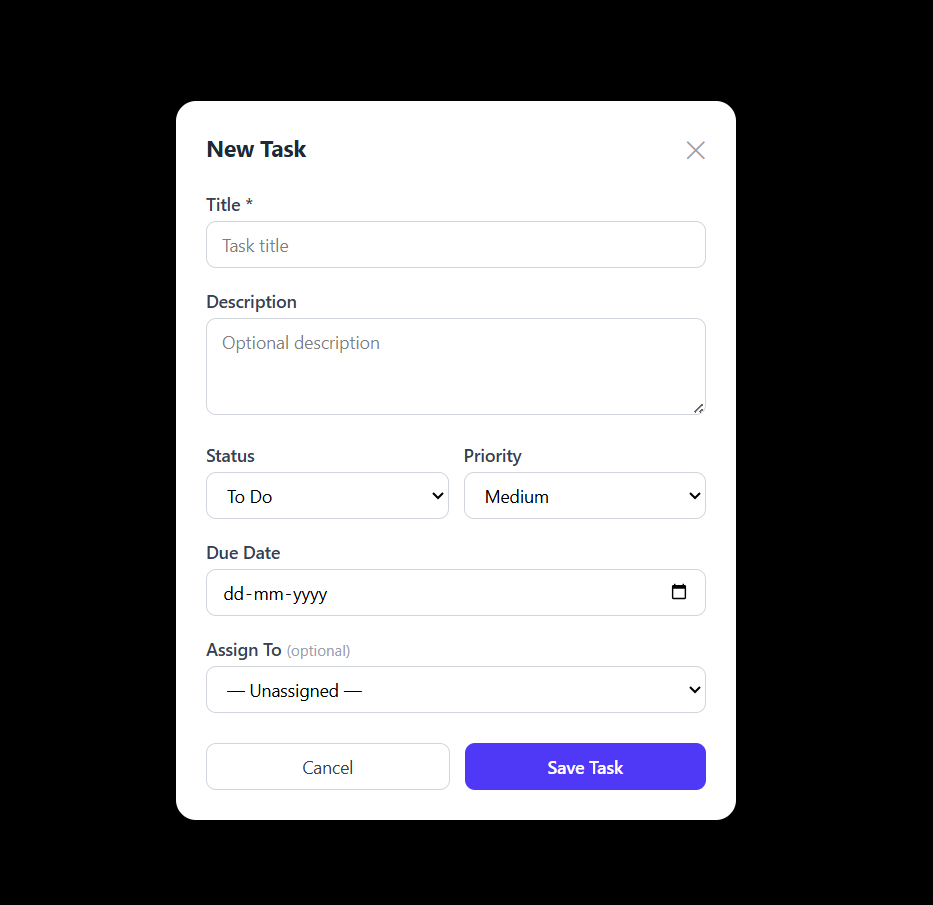
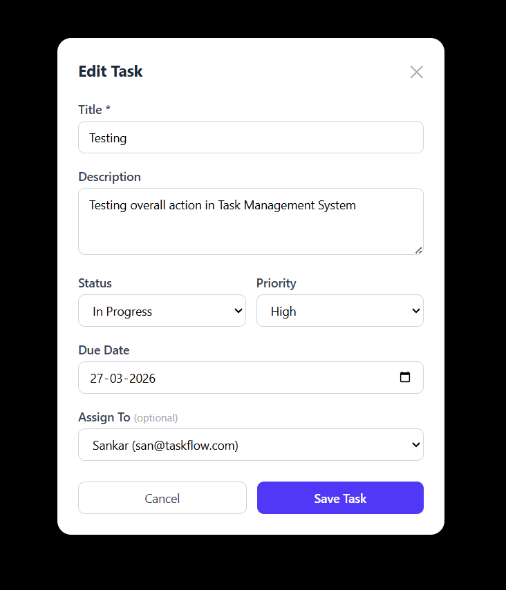

# TaskFlow — Task Management System


A full-stack task management app built with React, Spring Boot, MySQL, and Docker.


## Tech Stack
- **Frontend**: React + Vite + Tailwind CSS
- **Backend**: Spring Boot + JPA + MySQL + JWT Auth
- **DevOps**: Docker Compose + GitHub Actions CI/CD
- **Docs**: Swagger UI at `/swagger-ui/index.html`

## Prerequisites
- Docker & Docker Compose
- Java 25
- Node.js 22
- MySQL 8.0 (if running locally)

## Run with Docker (Recommended)
```bash
docker compose up --build
```
- Frontend: http://localhost:80
- Backend: http://localhost:8080
- Swagger UI: http://localhost:8080/swagger-ui/index.html

## Run Locally

### Backend
```bash
cd backend
./mvnw spring-boot:run
```

### Frontend
```bash
cd frontend
npm install
npm run dev
```
Frontend runs at http://localhost:5173

## Environment Variables
| Variable | Default | Description |
|---|---|---|
| SPRING_DATASOURCE_URL | localhost:3306 | MySQL connection URL |
| SPRING_DATASOURCE_USERNAME | root | DB username |
| SPRING_DATASOURCE_PASSWORD | taskflow123 | DB password |
| JWT_SECRET | (see properties) | JWT signing key |
| JWT_EXPIRATION | 86400000 | Token expiry in ms |

## API Endpoints
| Method | Endpoint | Auth | Description |
|---|---|---|---|
| POST | /api/auth/register | No | Register user |
| POST | /api/auth/login | No | Login |
| GET | /api/tasks | Yes | Get all tasks |
| POST | /api/tasks | Yes | Create task |
| PUT | /api/tasks/{id} | Yes | Update task |
| DELETE | /api/tasks/{id} | Yes | Delete task |
| GET | /api/users | Admin | Get all users |

## CI/CD
GitHub Actions runs on every push to `main`:
- ✅ Backend build & test
- ✅ Frontend build
- ✅ Docker Compose build

## Default Users (seeded)
| Email | Password | Role |
|---|---|---|
| admin@taskflow.com | admin123 | ADMIN |
| user@taskflow.com | user123 | USER |


## Screenshots

### Login Page


### Dashboard


### Tasks Page


### New Task Modal


### Edit Task Modal



---

##  Author

**Hemanth Abhinav**


